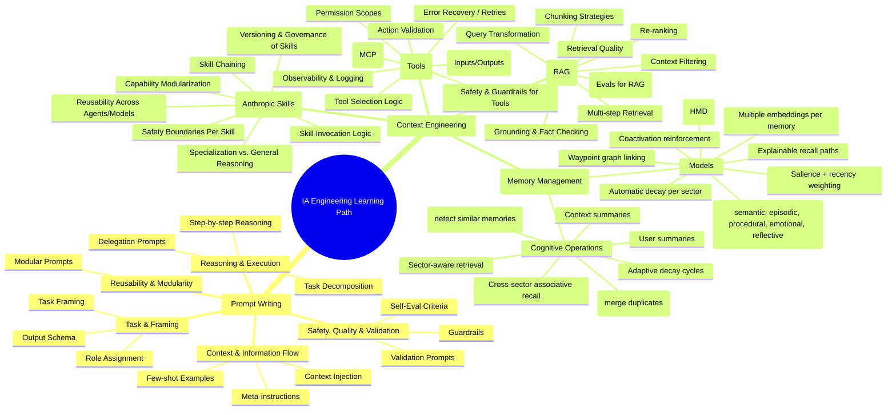

# AI Engineering Personal Learning Path

```mermaid
mindmap
  root((IA Engineering Learning Path))

    [Prompt Writing]

      Task & Framing
        Task Framing
        Role Assignment
        Output Schema
  
      Context & Information Flow
        Context Injection
        Few-shot Examples
        Meta-instructions
  
      Reasoning & Execution
        Step-by-step Reasoning
        Task Decomposition
        Delegation Prompts
  
      Safety, Quality & Validation
        Guardrails
        Validation Prompts
        Self-Eval Criteria
  
      Reusability & Modularity
        Modular Prompts

    [Context Engineering]

      (RAG)
        Retrieval Quality
        Chunking Strategies
        Re-ranking
        Context Filtering
        Query Transformation
        Grounding & Fact Checking
        Multi-step Retrieval
        Evaluation (Evals for RAG)
  
      (Tools)
        Model Context Protocol (MCP)
        Tool Schemas (Inputs/Outputs)
        Permission Scopes
        Tool Selection Logic
        Action Validation
        Observability & Logging
        Error Recovery / Retries
        Safety & Guardrails for Tools
  
      (Anthropic Skills)
        Capability Modularization
        Skill Invocation Logic
        Skill Chaining
        Specialization vs. General Reasoning
        Reusability Across Agents/Models
        Safety Boundaries Per Skill
        Versioning & Governance of Skills


      (Memory Management)
        Models
          Multi‑sector memory (semantic, episodic, procedural, emotional, reflective)
          Hierarchical Memory Decomposition (HMD)
          Multiple embeddings per memory
          Automatic decay per sector
          Coactivation reinforcement
          Salience + recency weighting
          Waypoint graph linking
          Explainable recall paths
        Cognitive Operations
          Pattern clustering (detect similar memories)
          Memory consolidation (merge duplicates)
          Context summaries
          User summaries
          Sector‑aware retrieval
          Cross‑sector associative recall
          Adaptive decay cycles
    
```

