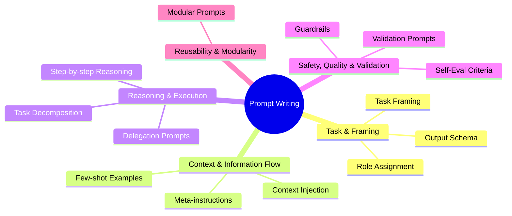
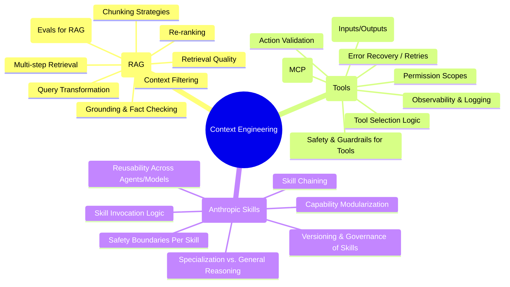
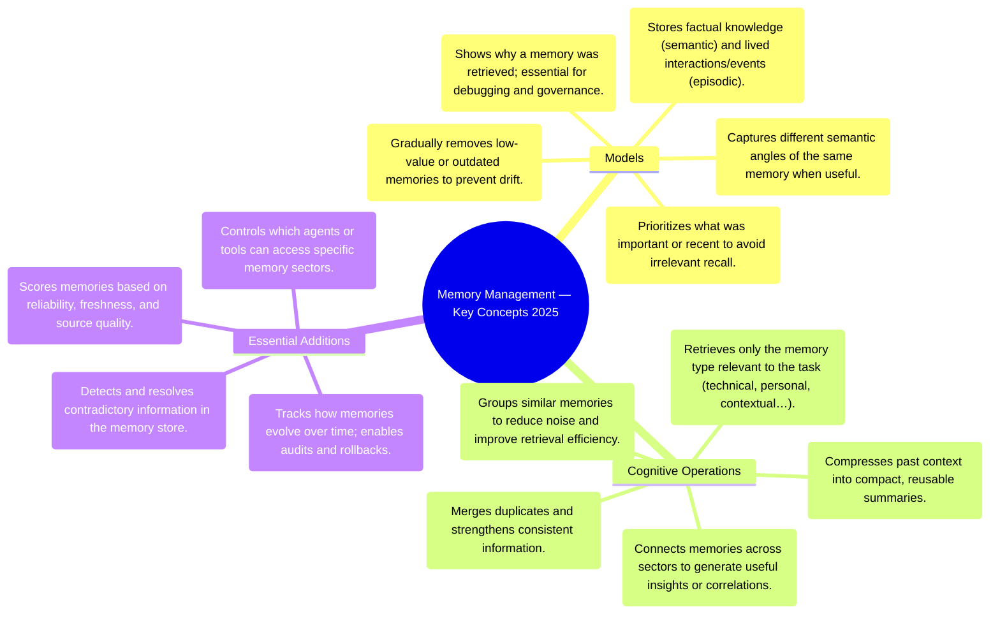

# AI Engineering Personal Learning Path

## 1. Prompt "Engineering"

```mermaid
---
config:
  layout: tidy-tree
---

mindmap
  root((Prompt Writing))
      Task & Framing
        Task Framing
        Role Assignment
        Output Schema
  
      Context & Information Flow
        Context Injection
        Few-shot Examples
        Meta-instructions
  
      Reasoning & Execution
        Step-by-step Reasoning
        Task Decomposition
        Delegation Prompts
  
      Safety, Quality & Validation
        Guardrails
        Validation Prompts
        Self-Eval Criteria
  
      Reusability & Modularity
        Modular Prompts

    
```

## 2. Context Engineering

```mermaid
---
config:
  layout: tidy-tree
---

mindmap
  root((Context Engineering))
      (RAG)
        Retrieval Quality
        Chunking Strategies
        Re-ranking
        Context Filtering
        Query Transformation
        Grounding & Fact Checking
        Multi-step Retrieval
        Evaluation (Evals for RAG)
  
      (Tools)
        Model Context Protocol (MCP)
        Tool Schemas (Inputs/Outputs)
        Permission Scopes
        Tool Selection Logic
        Action Validation
        Observability & Logging
        Error Recovery / Retries
        Safety & Guardrails for Tools
  
      (Anthropic Skills)
        Capability Modularization
        Skill Invocation Logic
        Skill Chaining
        Specialization vs. General Reasoning
        Reusability Across Agents/Models
        Safety Boundaries Per Skill
        Versioning & Governance of Skills
    
```

## 3. Memory Management

```mermaid
---
config:
  layout: tidy-tree
---
mindmap
  root((Memory Management — Key Concepts 2025))

    Models
      Semantic & Episodic Memory("Stores factual knowledge (semantic) and lived interactions/events (episodic).")
      Salience & Recency Weighting("Prioritizes what was important or recent to avoid irrelevant recall.")
      Automatic Decay("Gradually removes low-value or outdated memories to prevent drift.")
      Multiple Embeddings("Captures different semantic angles of the same memory when useful.")
      Explainable Recall Paths("Shows why a memory was retrieved; essential for debugging and governance.")

    Cognitive Operations
      Pattern Clustering("Groups similar memories to reduce noise and improve retrieval efficiency.")
      Memory Consolidation("Merges duplicates and strengthens consistent information.")
      Context Summaries("Compresses past context into compact, reusable summaries.")
      Sector-aware Retrieval("Retrieves only the memory type relevant to the task (technical, personal, contextual…).")
      Associative Recall("Connects memories across sectors to generate useful insights or correlations.")

    Essential Additions
      Memory Permissions("Controls which agents or tools can access specific memory sectors.")
      Memory Versioning("Tracks how memories evolve over time; enables audits and rollbacks.")
      Conflict Resolution("Detects and resolves contradictory information in the memory store.")
      Memory Validity Scoring("Scores memories based on reliability, freshness, and source quality.")
```

